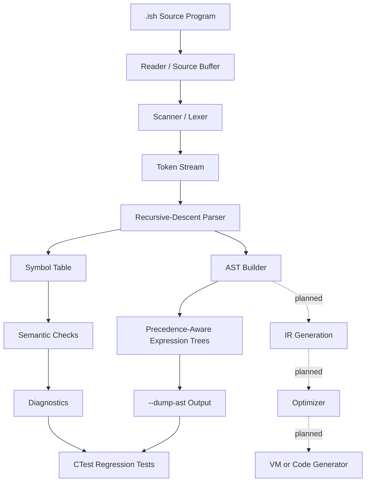

# Ish Compiler

Ish is a compiler-construction showcase implemented in C. It follows the classic front-end architecture described in compiler engineering texts: source buffering, lexical analysis, recursive-descent parsing, AST construction, symbol-table-backed semantic checks, and testable diagnostic output.

The project is intentionally small enough to understand end-to-end, but complete enough to demonstrate real compiler implementation techniques: dynamic source loading, tokenization, grammar recognition, precedence-aware expression trees, scope tracking, semantic validation, AST dumps, and repeatable CTest coverage.

## Why This Repo Stands Out

- It is written in C with explicit memory/data-structure decisions instead of hiding compiler logic behind parser generators.
- It implements a visible multi-phase compiler front end: reader, scanner, parser, AST, and semantic checks.
- It includes both Visual Studio project files and a portable CMake build for GCC, Clang, and MSVC workflows.
- It ships with curated `.ish` examples and automated smoke tests for reader, scanner, parser, semantic diagnostics, and AST output.
- It is structured for continued expansion into type checking, intermediate representation, optimization, and a VM or code generation backend.

## Workflow Overview



## Current Features

- Dynamic source reader/buffer.
- Deterministic scanner for comments, identifiers, integer/float/string literals, delimiters, arithmetic operators, relational operators, assignment, and keywords.
- Recursive-descent parser for the current showcase subset.
- AST construction for programs, functions, variable declarations, assignments, input, print, while blocks, returns, comments, literals, identifiers, function calls, and binary expressions.
- Precedence-aware expression ASTs for relational, additive, multiplicative, primary, function-call, and parenthesized expressions.
- Scoped symbol table for variables and functions.
- Semantic checks for duplicate declarations and undefined variable/function usage.
- `--dump-ast` mode for inspecting compiler output.
- CTest regression suite covering reader, scanner, parser, semantic diagnostics, and AST output.
- Portable CMake build for GCC, Clang, and MSVC.
- Visual Studio solution/project files.

## Supported Language Subset

- `funk name() { ... }` function declarations.
- `name();` function calls.
- `v ish_intg name;`, `v ish_flop name;`, `v ish_thread name;`, and `v longint name;` declarations.
- Assignment statements such as `total = left + right * scale;`.
- `print(...)` and `input(...)` built-ins.
- `while (condition) { ... }` blocks.
- `# ... #` block comments and `## ...` line comments.
- Expression precedence for comparisons, addition/subtraction, multiplication/division/modulo, grouping, literals, identifiers, and function-call expressions.

## Example

```ish
## Ish hello world example

funk sayHello() {
    print("Hello, world!");
}

sayHello();
```

AST dump:

```text
AST:
Program
  Comment
  FunctionDecl: sayHello
    Print
      Expression
        Literal: "Hello, world!"
  FunctionCall: sayHello
```

## Build

```sh
cmake -S . -B build
cmake --build build
ctest --test-dir build
```

The executable is named `ish`.

## Usage

```sh
./build/ish r examples/hello.ish
./build/ish s examples/hello.ish
./build/ish p examples/hello.ish
./build/ish p examples/volume.ish
./build/ish p examples/factorial.ish
./build/ish p examples/semantic-error.ish
./build/ish p examples/hello.ish --dump-ast
```

Next implementation targets are AST-based semantic analysis, type checking, and IR generation.

Modes:

- `r`: reader/buffer diagnostics.
- `s`: scanner/token diagnostics.
- `p`: parser diagnostics.
- `--dump-ast`: optional parser flag that prints the AST built for the parsed program.

## Test Coverage

The current CTest suite verifies:

- Reader source loading.
- Scanner tokenization.
- Parser acceptance for `hello`, `volume`, and `factorial` examples.
- Semantic error reporting for undefined variables.
- AST dumping for function declarations and binary expressions.

## Repository Layout

- `*.c`, `*.h`: current compiler implementation.
- `examples/`: sample Ish programs.
- `docs/`: language and compiler pipeline documentation.
- `CMakeLists.txt`: portable build definition.
- `Ish.sln`, `Ish.vcxproj`: Visual Studio project files.

## Roadmap

- Move semantic checks from parser callbacks to a dedicated AST traversal.
- Add type checking for assignments, operators, function returns, and built-ins.
- Add stable `--dump-tokens` output.
- Generate an intermediate representation.
- Add optimization passes such as constant folding and dead-code elimination.
- Add a VM or code-generation backend.
