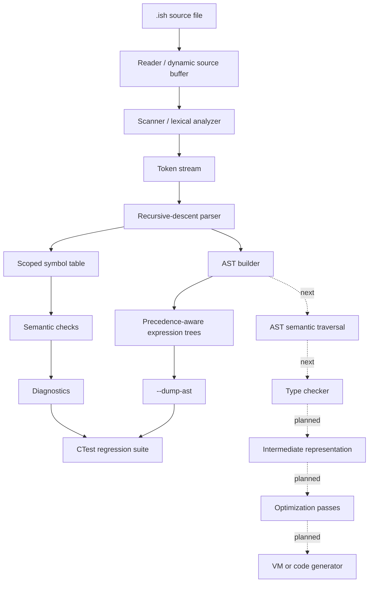

# Compiler Pipeline

Ish is being evolved toward a conventional multi-stage compiler pipeline.

## Workflow Details

1. Source programs enter through the reader, which loads text into a dynamic buffer.
2. The scanner converts source text into tokens for identifiers, keywords, literals, comments, operators, and delimiters.
3. The parser recognizes the supported Ish grammar with hand-written recursive descent.
4. Parser productions build an AST for declarations, statements, blocks, calls, literals, identifiers, and binary expressions.
5. Expression parsing preserves precedence across relational, additive, multiplicative, primary, call, and parenthesized expressions.
6. The symbol table tracks variable and function declarations with scope depth.
7. Semantic checks report duplicate declarations and undefined variable/function usage.
8. `--dump-ast` exposes the parsed tree for debugging, tests, and demonstration.
9. CTest runs reader, scanner, parser, semantic, and AST smoke tests.

## Current Status

- Reader: present and covered by smoke tests.
- Scanner: deterministic tokenization is present; location-aware diagnostics are still planned.
- Parser: recursive-descent parsing covers the current examples and builds precedence-aware expression ASTs with `--dump-ast`.
- Semantic analysis: initial scoped symbol table checks are present; type checking is planned.
- IR: planned.
- Optimizer: planned.
- Runtime/backend: planned.

## Near-Term Engineering Priorities

- Keep the build portable with CMake and Visual Studio.
- Add repeatable tests before large rewrites.
- Prefer small, verifiable compiler phases over hidden global state.
- Emit stable dump formats for tokens, AST, and IR so behavior can be tested with golden files.
